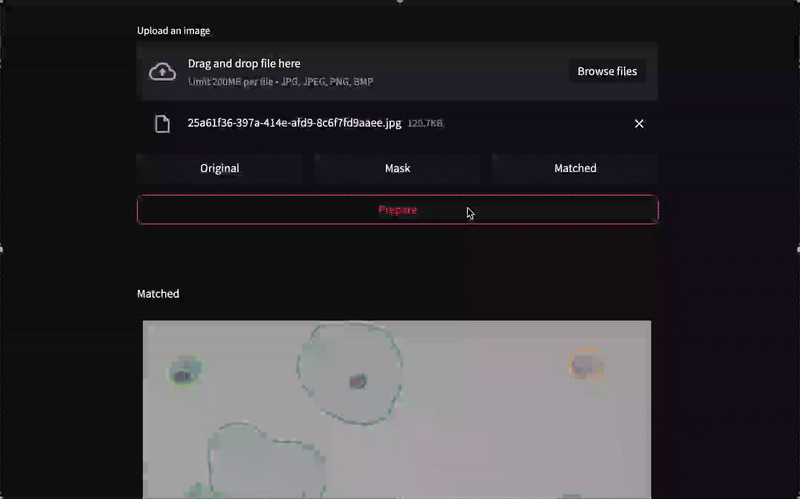

# Development of a model to identify cervical cell abnormalities.

## About Project

This project focuses on developing an AI-powered image processing pipeline to detect and classify cervical cell abnormalities from Pap smear slide images. The project aims to support cervical cancer screening by automating the identification of abnormal cellular features based on morphometric criteria.

The workflow is divided into two main stages:
    
1. Segmentation Stage,
A deep learning model based on Detectron2 is used to automatically segment the nucleus and cytoplasm of cervical cells. From the segmented regions, we compute the Nucleus-to-Cytoplasm Ratio (N/C Ratio), which is a known biomarker for identifying abnormal cell behavior (e.g., hyperchromatic nuclei or increased nuclear size).
    
2. Classification Stage,
The extracted N/C ratio, along with additional features (e.g., area, shape), is fed into a machine learning classifier to categorize cells into either Normal cells, Abnormal cells (suspected of pre-cancerous or cancerous transformation)

- Dataset Source: Pap smear slide images were obtained from the National Cancer Institute of Thailand.

- Annotation Tool: Image annotations (nucleus and cytoplasm regions) were created using makesense.ai.

- Segmentation Model: Used Detectron2 to train an instance segmentation model for detecting and segmenting nuclei and cytoplasm.

- Classification Models: Employed three pre-trained CNN architectures for classifying cells into normal and abnormal categories.

- Matching Algorithm: Applied the Hopcroft–Karp algorithm to accurately match each nucleus with its corresponding cytoplasm region (based on bipartite graph matching).

- N/C Ratio Calculation: Computed the Nucleus-to-Cytoplasm Ratio (N/C Ratio) using the formula
``` math
N\!/\!C~\text{ratio} = \frac{N_a}{C_a}
```

## Overview Application

- Preview of Nucleus and Cytoplasm Region Detection Using an Instance Segmentation Model


- Preview of the N/C ratio calculation based on nucleus and cytoplasm areas, with the risk level represented using color shading.


- Preview of the area detection accuracy in comparison with ground truth annotations.


## Install Application
``` bash
git clone https://github.com/watcharapol28/Cervical-Cell-Abnomalities.git
```

### Mac OS
1. Install Miniforge3 (Conda)

A lightweight Conda distribution optimized for macOS (especially Apple Silicon), using conda-forge as the default channel for better compatibility and performance.

``` bash
curl -LO https://github.com/conda-forge/miniforge/releases/latest/download/Miniforge3-MacOSX-arm64.sh
```
2. Activate Conda
``` bash
conda create -n miniforce3 python=3.9.6 
conda activate cervical-env
```

3. Install Python 3.9.6

Python 3.9.6 ensures compatibility with Detectron2 and PyTorch
``` bash
conda install python=3.9.6
```

4. Install detectron2
``` bash
pip install 'git+https://github.com/facebookresearch/detectron2.git'
```

5. Install libraries from the [requirements.txt]() file.
``` bash
pip install -r requirements.txt
```

### Windows
1. Install [Python 3.9.6](https://www.python.org/downloads/release/python-396/)

2. Install [CUDA 11.8](https://developer.nvidia.com/cuda-11-8-0-download-archive?target_os=Windows&target_arch=x86_64&target_version=11&target_type=exe_network)

Required for GPU acceleration with PyTorch and Detectron2. CUDA 11.8 matches the compatible version for recent PyTorch + torchvision builds.

3.Install [Microsoft C++ Build Tools](https://visualstudio.microsoft.com/visual-cpp-build-tools/)

Required to compile native extensions used by PyTorch and Detectron2. 

4. Install Detectron2
``` bash
git clone https://github.com/facebookresearch/detectron2.git
```

A high-performance object detection and segmentation library built on top of PyTorch.


5. Install libraries from the [requirements.txt]()
``` bash
pip install -r requirements.txt 
``` 
to ensure all required Python packages are available.


## Using Application

Once all installation steps are completed, you may use the following command to start the application.
``` bash
streamlit run streamlit_app.py
```

## Additional
Currently, there are three main models, each trained on datasets of low, high, and mixed complexity. These models are stored in the Models directory.

If model customization is needed, the instance segmentation model (Detectron2) can be modified in the [Section1_Model.ipynb]() notebook, which contains organized code sections with additional explanations. For the classification model (3 Pretrained CNNs Models), modifications can be made in the [Section2_Model.ipynb]() notebook.
